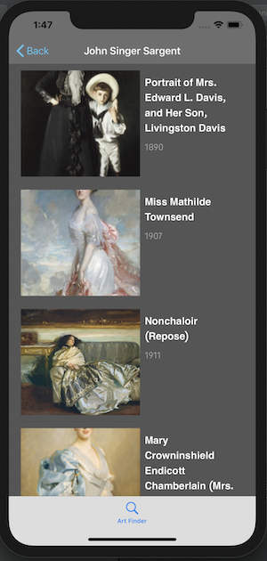

# ArtFinder

## About the app

The ArtFinder app allows users to search for an artist, get a list of their artworks
and details of the art pieces including where the artwork is currently displayed.

ArtFinder was created using the [Artsy API](https://developers.artsy.net) (search, artists, and artworks)

When the app is first opened, there is an empty tableview that populates as the viewer searches for an artist.


Once the table cell is clicked, the view segues to an artist's page which displays the years they were alive, their nationality, a biography and a link to their list of artworks.


The artworks list is presented in a tableview.



By selected a table cell the view segues to a description of the artwork included where the art piece is currently displayed.


## Getting artist information based on the search results
```swift
  func loadData(for search: String) {
        ArtFinderAPIClient.getSearch(for: search) { [weak self] (result) in
            switch result {
            case .failure(let appError):
                print(appError)
            case .success(let artist):
                self?.artistResults = artist.filter{$0.type == "artist"}
            }
        }
        
    }
    func loadArtist(){
        let link = artistResults.first?.links?.selflink?.href?.components(separatedBy: "/")
        let artID = link?.last ?? ""
        ArtFinderAPIClient.getArtist(with: artID) { (result) in
            switch result{
            case .failure(let artistError):
                print(artistError)
            case .success(let artInfo):
                self.artist = artInfo
            }
        }
    }
```
